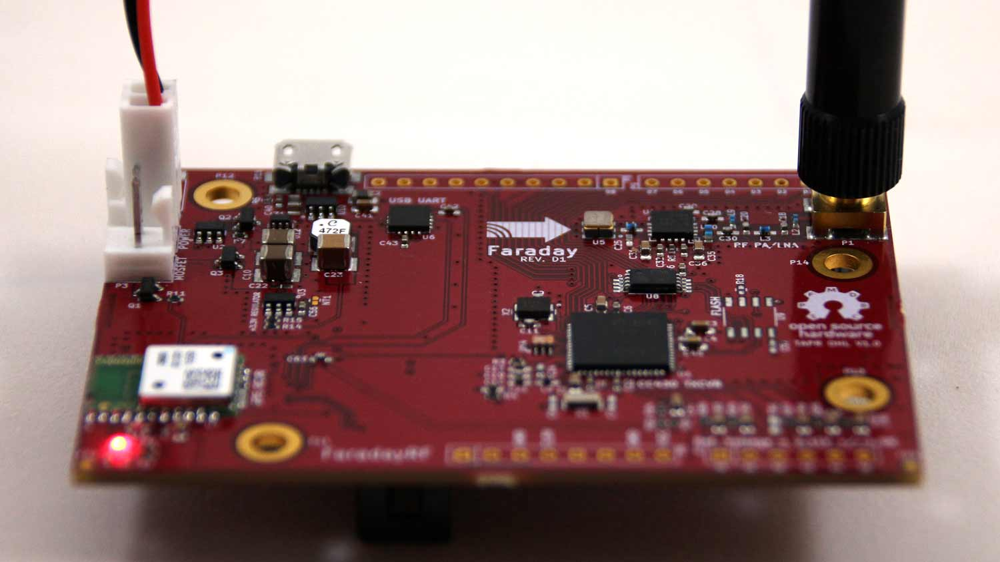

by [FaradayRF](https://www.faradayrf.com)

Faraday is a 33cm (902-928MHz) amateur band digital radio. It is more than just another Industrial, Scientific, and Medical band transceiver (ISM). Faraday takes advantage of the ISM hardware in order to let us focus on the real tasks we want to accomplish, pushing ham radio forward. The FaradayRF [Master Plan](https://faradayrf.com/faradayrf-master-plan/) details these tasks. Providing a well documented and educational digital wireless ham radio platform enabling an infrastructure to be built from is among the first of our goals. This repository is our software to enable this goal.

Our mission is simple
>To educate and enable radio amateurs to advance the state of ham radio

> Faraday software is in a pre-alpha. This means we have not developed all necessary software or performed extensive testing. Your help will not only help advance ham radio but give you a voice in its direction.

## Newsletter
Join our [mailing list](http://eepurl.com/cdsu21)!

## RESTfully Ham Radio
You will quickly notice that the Faraday software aims to bridge the radio world with the web development world. Making web developers feel at home and leveraging web toolkits and libraries is a powerful asset to the radio community.

# Quick-Start
Just purchase or build a Faraday radio? Check out our [quick-start](Tutorials/start) guide to get up and running fast.

## Using Applications
Once setup and familiar with the basics of Faraday we encourage you to explore our core applications. These applications also example how developers can leverage the Faraday hardware and API to develop solutions. Faraday is much more about developing useful applications and use-cases than just the cool hardware it is. Have fun! We certainly are.

### Proxy
[Proxy](proxy/) is the core of our software. It represents physical hardware to the programmer. If you are sending or receiving data to/from Faraday then you are using Proxy. Abstracting the mundane housekeeping means we can focus on building solutions to new problems.

### Device Configuration
[Device Configuration](Applications/deviceconfiguration) provides a convenient method of programming basic configuration values onto Faraday hardware over a local USB connection.

### Telemetry
[Telemetry](Applications/Telemetry/) retrieves data from a USB connected Faraday radio saving telemetry to a SQLite database for future queries. Telemetry from both local and RF linked radios is handled. A RESTful API lets developers build data logging and handling into any solution.

### APRS
[APRS](Applications/APRS) bridges the gap between the Faraday network interface data and the APRS-IS system. There's no reason Faraday cannot appear to be an APRS station and therefore this application let's you do just that.

### Simple Message
[Simple Message](Applications/simplemessage) Provides messaging functionality over RF paths. Simple as that.

# Contributing
Absolutely! Join us in developing the future of ham radio. Check out [our contribution](CONTRIBUTING.md) guide. All are welcome to pitch in regardless of experience level.
 * Learn about the [fork, branch, and pull request workflow](https://gist.github.com/Chaser324/ce0505fbed06b947d962) on GitHub.
 * Solve one of our [Beginner Issues](https://github.com/FaradayRF/Faraday-Software/labels/Beginner). These are specifically marked as easy problems we need help with that could be your first pull request!
 * Submit an [issue ticket](https://github.com/FaradayRF/Faraday-Software/issues) to tell us about a bug, feature request, documentation error, or documentation improvement.

The project maintainers are [@KB1LQC](https://github.com/kb1lqc) and [@KB1LQD](https://github.com/kb1lqd). We're more than happy to answer any questions. You may also reach us at Support@FaradayRF.com. You should also follow us on Twitter [@FaradayRF](https://twitter.com/faradayrf). We love Twitter.
