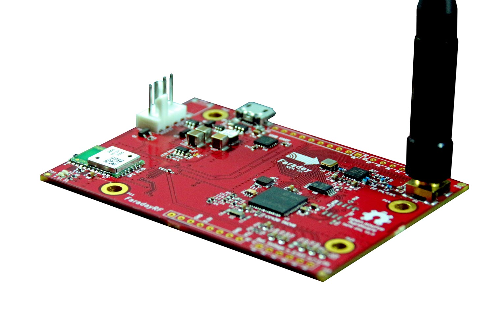

The future of amateur radio looks exciting. [FaradayRF](https://www.faradayrf.com) has one mission
>To educate and enable radio amateurs to advance the state of ham radio

Drive with open source software based on providing a toolbox of support such as an API and core applications, Faraday solves fundamental problems necessary to experiment with digital radio. So be creative, have fun, and let's push the hobby forward together.

> Faraday software is in a pre-alpha. This means we have not developed all necessary software or performed extensive testing. Your help will not only help advance ham radio but give you a voice in its direction.

# Quick-Start
Farady is continually becoming more streamlined to use. Check out our [quick-start](Tutorials/start) guide to get up and running fast.

# Software Overview
The software that powers Faraday is based on the principle of serving data over the localhost network interface. This makes using ham radio to solve problems more similar to web and app development than low-level programming. Of-course you can dive into the code and implement other low-level solutions but most of us want build solutions with ham radio. We're helping you do that.

## Proxy
[Proxy](proxy/) is the core of our software. It represents physical hardware to the programmer. If you are sending or receiving data to/from Faraday then you are using Proxy. Abstracting the mundane housekeeping means we can focus on building solutions to new problems.

## Device Configuration
[Device Configuration](Applications/deviceconfiguration) provides a convenient method of programming basic configuration values onto Faraday hardware over a local USB connection.

## Telemetry
[Telemetry](Applications/Telemetry/) retrieves data from a USB connected Faraday radio saving telemetry to a SQLite database for future queries. Telemetry from both local and RF linked radios is handled. A RESTful API lets developers build data logging and handling into any solution.

## APRS
[APRS](Applications/APRS) bridges the gap between the Faraday network interface data and the APRS-IS system. There's no reason Faraday cannot appear to be an APRS station and therefore this application let's you do just that.

## Simple Message
[Simple Message](Applications/simplemessage) Provides messaging functionality over RF paths. Simple as that.

# Contributing
Absolutely! Join us in developing the future of ham radio. Check out [our contribution](CONTRIBUTING.md) guide.
 * Help implement new functions and write better code
 * Report problems and frustrations
 * Help recreate problems
 * Help solve issues