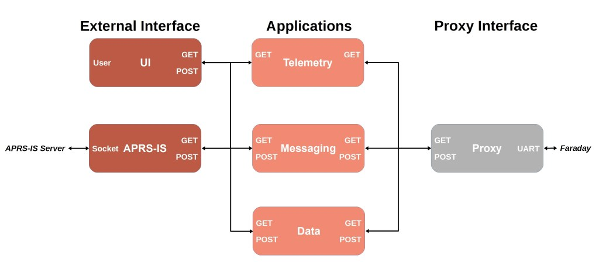

# The Proxy Interface

[Proxy](../../../../proxy) is the gateway to Faraday. It is a Flask server providing a RESTful interface with Faraday hardware. All actions with Faraday from a computer go through Proxy.



## Configuring Proxy
Proxy.ini contains the necessary configuration values to properly connect with and identify hardware. Multiple Radios can be connected at once by simple extension of the [UNITS] sections.

>This guide assumes you have already [connected a Faraday radio](../Getting_Started/connecting-hardware.md) to your computer

### Proxy Configs Overview
 * ```[FLASK]```: Flask configuration values
  * ```HOST```: IP Address or hostname of flask server.
  * ```PORT```: Flask port to serve data
 * ```[PROXY]```: Proxy server high level configuration
  * ```UNITS```: Number of Faraday radios connected to computer.
 * ```[UNIT0]```: Unit 0 Proxy configuration values
  * ```CALLSIGN```: Callsign to associate with radio on this USB port.
  * ```NODEID```: Node ID of radio connected on this USB port.
  * ```COM```: COM Port associated with radio connected on this USB port.
  
The image below shows the default `proxy.ini` contents as viewed in a text editor.


### Windows

 1. Open the `proxy-template.ini` file in a text editor to edit ```[UNIT0]``` values
 2. Change ```CALLSIGN``` Replace ```NOCALL``` to match your callsign
 3. Change ```NODEID``` to an appropriate node ID value that is not already in use. Numbers between 0-255 are valid.
 4. Change ```COM``` to match the COM port indicated while [connecting Faraday](../Getting_Started/connecting-hardware.md). ```x``` represents a number.
 5. Save the file as ```proxy.ini```

```BAUDRATE``` and ```TIMEOUT``` Should not be changed unless you are intending to do so.

A proper configuration file will look similar to the configuration below. Notice the radio is "KB1LQD-1" on COM71.


###Linux (Debian-Based)
Update with configuration

## Connecting Proxy to Faraday

Double-click on ```proxy.py``` to run it. With Faraday connected and ```proxy.py``` properly configured you will see a screen similar to that shown below.


> Once connected leave proxy running. It is a background application which provides a service to our core applications.

Congratulations, Proxy is now running successfully!

### Connection Error

An incorrect COM port assignment or unconnected Faraday radio will cause the following common error to appear.


> Check your COM port settings and that you did not change ```baudrate``` in ```proxy.ini```

## Connecting To Multiple Faraday Devices

The proxy interface can connect to more than one Faraday digital radio at a time and this is achieved by creating more instances of ```[UNITx]``` sections and updating the ```Units``` value in the ```[PROXY]``` section.

### Windows
 1. [Connect](../Getting_Started/connecting-hardware.md) ***both*** Faraday radios to your computer via USB and identify their respective COM ports. 
 2. Open and configure the `proxy.ini` by changing ```Units``` in the [PROXY] section and adding a second ```[UNITx]``` section.

A proper ```proxy.ini``` configuration file will resemble the example below.


# Interfacing Proxy
It's time to move on and [interface with Proxy](commands.ini) to communicate and command Faraday.