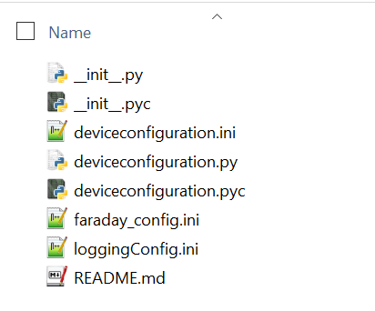
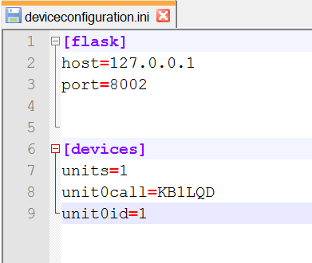

# Tutorial - Device Configuration

This tutorial will example how to use the Device Configuration program to both read and write non-volatile Faraday unit configuration using the proxy interface. This configuration data is stored in the CC430 Flash memory and is used to store the units callsign, ID, and other information/default settings.

Reconfiguring the non-volatile memory on Faraday requires using the "Device Configuration" proxy application.

> NOTE: Device Configuration using the application tool in this tutorial is currently limited to programming a single device at a time.

#Running The Tutorial Example Script

## Start The Proxy Interface

Following the [Configuring Proxy](../../0-Welcome_To_Faraday/Configuring_Proxy/) tutorial configure, start, and ensure a successful connection to a locally (USB) connected Faraday digital radio.

## Start The Device Configuration Application

In the Applications folder locate and open the folder named *"deviceconfiguration".*

Open the *"deviceconfiguration.ini"* file with a text editor.

Update the INI section **[devices]** contents to match that of the proxy interface configuration file for the respective Faraday unit you wish to program with a new configuration. Save the file when completed. For example, to connect the Device Configuration tool to `KB1LQD-1` The file would be updated as shown below.

Run the *"deviceconfiguration.py"* python script. A successful connection will show a terminal output similar to below.

#See Also

