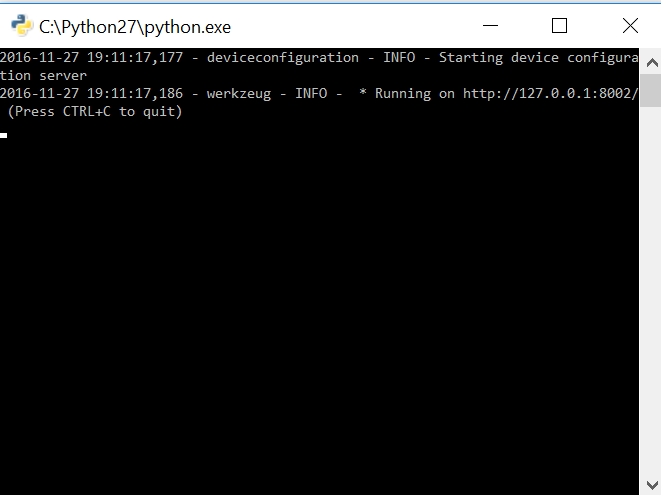
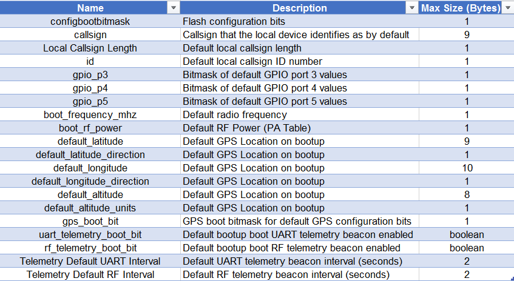

# Tutorial - Device Configuration

This tutorial will example how to use the Device Configuration program to both read and write non-volatile Faraday unit configuration using the proxy interface. This configuration data is stored in the CC430 Flash memory and is used to store the units callsign, ID, and other information/default settings.

Reconfiguring the non-volatile memory on Faraday requires using the "Device Configuration" proxy application. The configuration can both be read from the device and reprogrammed. The device application program uses the `faraday_config.ini` file to reprogram a Faraday device, sending a RESTful POST command to the program initiates the reading, parsing, and command creation from the `faraday_config.ini` file.

> NOTE: Device Configuration using the application tool in this tutorial is currently limited to programming a single device at a time.


#Running The Tutorial Example Script

## Start The Proxy Interface

Following the [Configuring Proxy](../../0-Welcome_To_Faraday/Configuring_Proxy/) tutorial configure, start, and ensure a successful connection to a locally (USB) connected Faraday digital radio.

## Start The Device Configuration Application

In the Applications folder locate and open the folder named *"deviceconfiguration".*


Open the *"deviceconfiguration.ini"* file with a text editor.


Update the INI section **[devices]** contents to match that of the proxy interface configuration file for the respective Faraday unit you wish to program with a new configuration. Save the file when completed. 

* `units` = 1
* `unit0call` = Callsign of proxy Faraday device to reconfigure
* `unit0id` = Callsign ID number (0-255) of proxy Faraday device to reconfigure

For example, to connect the Device Configuration tool to `KB1LQD-1` The file would be updated as shown below.


Run the *"deviceconfiguration.py"* python script. A successful connection will show a terminal output similar to below.



## Edit Faraday Configuration Settings

Open the `faraday_configuration.ini` file in a text editor. Edit all of the fields with the intended reprogramming values.


The table below describes each INI file option and maximum size. Also supplied is the BITMASK configuration description table.




Save the file when all updates are completed.

## Execute Tutorial Script

After all configuration files have been updated simply sending a POST command to the device configuration program will cause the `faraday_configuration.ini` file to be read and configuration command created and sent to reprogram the unit.


#Code Overview

## Code - Read Current Configuration

The code snippet from the tutorial script below uses sends a RESTful API `GET()` request to the device configuration application running on localhost port 8002. The request returns a JSON formatted dictionary of the current values in the device configuration flash memory which is then printed to the terminal.

```python
#########################################################################################
###Get current configuration information prior to configuration update.
#########################################################################################

#Display current device configuration prior to configuration flash update (Send UART telemetry update now command)
#Send the command to read the entire Flash Memory Info D allocations

try:
    r = requests.get("http://127.0.0.1:8002", params={'callsign': str(local_device_callsign), 'nodeid': int(local_device_node_id)})
except requests.exceptions.RequestException as e:  # This is the correct syntax
    print e

#Print JSON dictionary device data from unit
print r
raw_unit_json = r.json()
print "\n************************************"
print "PRIOR TO CONFIGURATION UPDATE"
print "Unit Callsign-ID:\n", str(raw_unit_json['local_callsign']) + '-' + str(raw_unit_json['local_callsign_id'])
print "RAW Unit JSON Data:", raw_unit_json
print "************************************"
```

### Using POSTman To GET() Unit Configuration JSON

the [POSTman Chrome application](https://chrome.google.com/webstore/detail/postman/fhbjgbiflinjbdggehcddcbncdddomop?hl=en) is useful for debugging RESTful API's and clearly shows the returned JSON configuration data. This is identical to the JSON data being received by the tutorial script.

")


## Code - Update Device Configuration

Using a POST() request to the device configuration application running the program will read the configuration ini file for the unit and reprogram the intended Faraday device.

```python
#########################################################################################
###Update configuration using INI file as defined by Faraday device object and functions
#########################################################################################

time.sleep(1) # Sleep to allow unit to process, polling and slow

try:
    r = requests.post('http://127.0.0.1:8002', params={'callsign': str(local_device_callsign), 'nodeid': int(local_device_node_id)})
except requests.exceptions.RequestException as e:  # This is the correct syntax
    print e

time.sleep(5) # Sleep to allow unit to process, polling and slow, not sure why THIS slow...
```

## Code - Re-Read Device Configuration (After Reprogramming)

The last of the code in the tutorial simply re-reads the device configuration that should now be updated to the values listed in the conifguration INI file as reprogrammed and shown in the example output above.

```python
try:
    r = requests.get("http://127.0.0.1:8002", params={'callsign': str(local_device_callsign), 'nodeid': int(local_device_node_id)})
except requests.exceptions.RequestException as e:  # This is the correct syntax
    print e

#Print JSON dictionary device data from unit
raw_unit_json = r.json()
print "\n************************************"
print "POST CONFIGURATION UPDATE"
print "Unit Callsign-ID:\n", str(raw_unit_json['local_callsign']) + '-' + str(raw_unit_json['local_callsign_id'])
print "RAW Unit JSON Data:", raw_unit_json

print "************************************"
```


#See Also

* [Python Request Module](http://docs.python-requests.org/en/master/)

