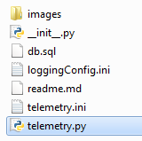

# Telemetry
The Telemetry application is a core application provided by FaradayRF. Its basic function is to receive telemtry packets from Faraday, local or remote, and save them to an SQLite database. Doing so allows us to document the data as well as query it easily in the future.

Basing Telemetry on a [Flask](http://flask.pocoo.org/) server allows it to provide a RESTful interface to the network interface from which other applications such as a user interface or [APRS](../aprs) can query the saved data using simple HTTP GET commands.

[DB Browser for SQLite](http://sqlitebrowser.org/) is a great tool which allows you to manipulate the database and perform simple plotting. It's simple to use the program to export a CSV for plotting in Excel as well.

## Configuration

Telemetry uses [telemetry.ini](telemetry.ini) to properly connect to Proxy and save data to a SQLite database. This configuration file contains the following:

* `[flask]` Flask telemetry server section
 * `host` Flask hostname or IP address
 * `port` Network port to serve data

* `[database]` Telemetry SQlite database section
 * `filename` Database filename "x.db"
 * `schemaname` SQLite schema file to setup tables "x.sql"

* `[telemetry]` Telemetry application section
 * `units` Quantity of Faraday radios connected to computer
 * `unit0call` Callsign of first radio
 * `unit0id` Node ID of first radio

Configuring Telemetry consists of changing three parameters for basic use. The three configs to change are `units`, `unit0call`, and `unit0id`. These will let Telemetry properly query Proxy to obtain the correct telemetry data. Simply replace these values with appropriate data similar to how one configured [proxy.ini](../proxy/proxy.ini).

## Running Telemetry

> Telemetry expects [Proxy](../proxy) to be running on the same computer. Please ensure it is running in a window before attempting to start this application.

### Windows

There are two ways to start Telemetry in Windows. First by command line and secondly by double-clicking on the file in explorer.

#### Command Line
1. Navigate to telemetry folder i.e. `cd C:\git\faradayrf\software\telemetry`
2. Open telemetry.py with python `python telemetry.py`

#### Explorer
1. Double-click on `telemetry.py`

2. Confirm python window opens and remains open

#### Explorer